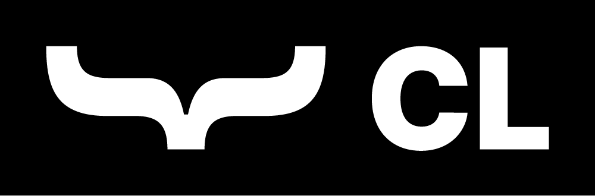
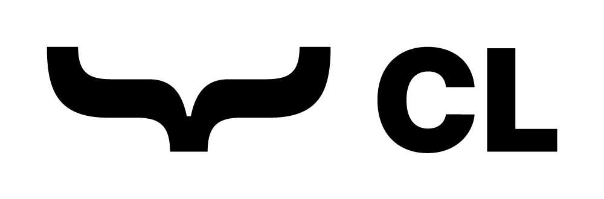
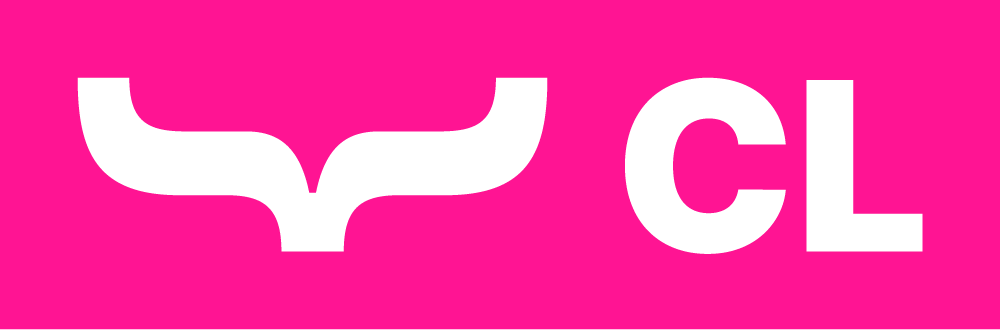

# Catch License 1.0.0 (CL-1.0.0)

The Catch License simplifies creating and sharing compatibility patches for software modifications ("mods"). Mods often enhance games, but they don't always integrate seamlessly with each other. Compatibility patches solve this by ensuring different mods can function side-by-side.

This license encourages collaboration between mod authors and patch creators, while respecting original work and maintaining consistent terms downstream.

## Key Goals

- **Support for Compatibility**: Makes it easy for patch creators to share their work.
- **Respect for Mod Authors**: Ensures proper attribution and protects the author's rights.
- **Transparency**: Requires compatibility patches to be open-source.
- **Fairness**: Prohibits granting permissions not owned and ensures consistent licensing terms.

**Note on Monetization:**
While the Catch License does not itself restrict monetization, platform rules, author preferences, or community norms may discourage or prohibit monetizing compatibility patches. It's often considered good practice not to monetize or enable donation points for compatibility patches unless explicitly permitted by both the Mod Author and the platform's policies.

## Full License Text

The complete Catch License text is available [here](./cl.md).

## Getting Started

- **Mod Authors**: Learn how to apply the license and understand its benefits in [For Mod Authors](./docs/for_mod_authors.md).
- **Patch Creators**: Review the guidelines and requirements for creating compatibility patches in [For Patch Creators](./docs/for_patch_creators.md).

## Badges

Show your commitment to the Catch License by adding one of these badges to your mod or patch description:

|| light mode | dark mode | any mode | dynamic |
|---|---|---|---|---|
|SVG|||||
|PNG|||||

## Additional Resources

- **FAQ**: Find answers to common questions in the [FAQ](./docs/faq.md).
